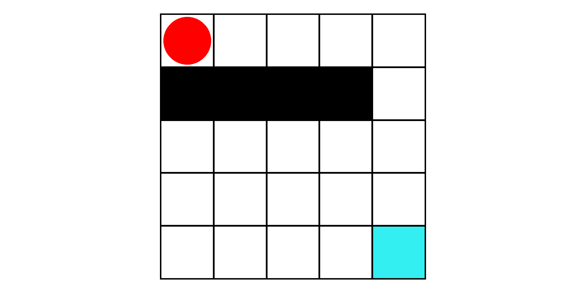
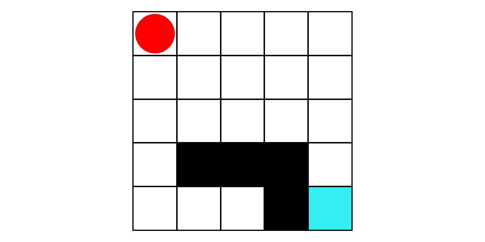

# LLM Planning Report

> Generated at 19:20:20 on 07/09/2023

- **Domain**: navigation-2d
- **Representation**: nl-casual
- **Examples Given to LLM**: 0 examples
- **Count**: 3 test cases

## Test Case 0

### Prompt

You are a robot in a discrete finite grid. You start at a certain position and aim to reach the goal position. However, you can only move one square at a time and you cannot move diagonally. There may be obstacles in your path, which you cannot move onto or over. Coordinates are represented as (x,y).
The grid is 5 wide and 5 tall. You are initially located at (0,0) and you need to get to (4,4). There are no obstacles.
 Please reply only with the sequence of coordinates that you visit.

    

### Response

The sequence of coordinates that you visit to reach the goal position (4,4) without any obstacles is as follows:

(0,0) -> (0,1) -> (0,2) -> (0,3) -> (0,4) -> (1,4) -> (2,4) -> (3,4) -> (4,4)

## Test Case 1

### Prompt

You are a robot in a discrete finite grid. You start at a certain position and aim to reach the goal position. However, you can only move one square at a time and you cannot move diagonally. There may be obstacles in your path, which you cannot move onto or over. Coordinates are represented as (x,y).
The grid is 5 wide and 5 tall. You are initially located at (0,0) and you need to get to (4,4). There are obstacles at (0,1), (1,1), (2,1), and (3,1).
 Please reply only with the sequence of coordinates that you visit.

    

### Response

The sequence of coordinates that you visit to reach the goal position (4,4) without touching the obstacles is as follows:

(0,0) -> (1,0) -> (1,2) -> (2,2) -> (3,0) -> (3,2) -> (4,2) -> (4,3) -> (4,4)

## Test Case 2

### Prompt

You are a robot in a discrete finite grid. You start at a certain position and aim to reach the goal position. However, you can only move one square at a time and you cannot move diagonally. There may be obstacles in your path, which you cannot move onto or over. Coordinates are represented as (x,y).
The grid is 5 wide and 5 tall. You are initially located at (0,0) and you need to get to (4,4). There are obstacles at (1,3), (2,3), (3,3), and (3,4).
 Please reply only with the sequence of coordinates that you visit.

    

### Response

The sequence of coordinates that you visit to reach the goal position, avoiding the obstacles, would be:

(0,0), (0,1), (0,2), (0,3), (0,4), (1,4), (2,4), (3,2), (4,2), (4,3), (4,4)

